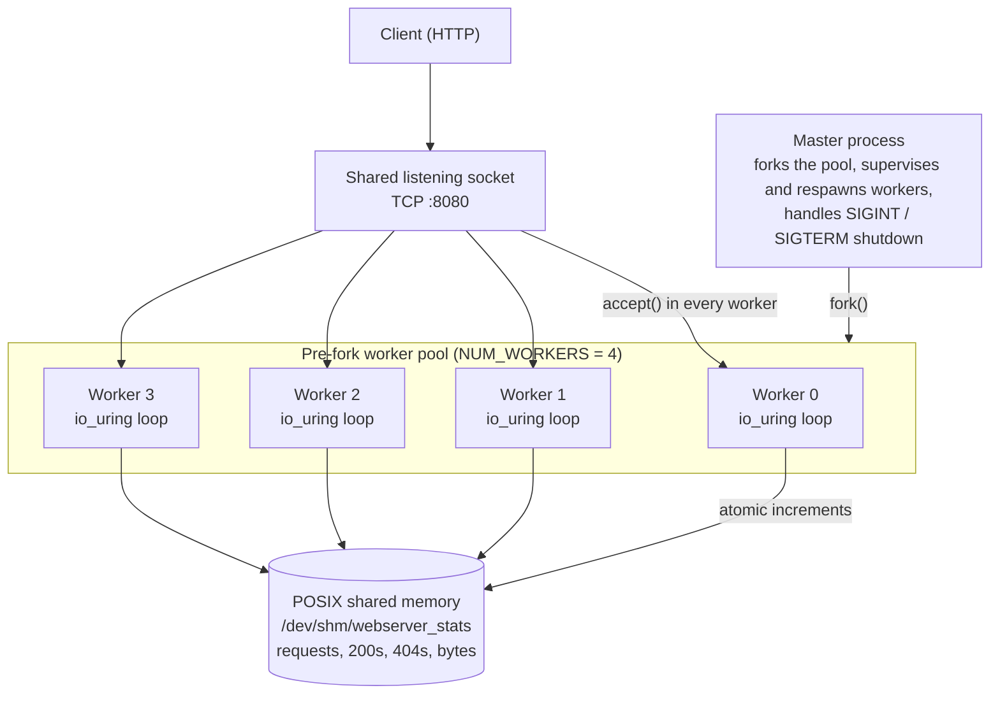
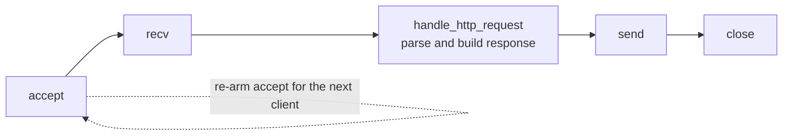

# Metric-Aware High-Performance C Web Server

A low-level HTTP server written from scratch in C, showcasing POSIX systems programming, inter-process communication (IPC), asynchronous I/O with `io_uring`, and reproducible container deployment.

Built as a systems-engineering portfolio project, it combines a classic Unix **pre-fork worker pool** with a modern Linux **`io_uring`** event loop in every worker, and exposes live request metrics from POSIX shared memory.

---

## Architecture



### 1. Concurrency model

- **Pre-fork worker pool (`fork`)**: the master creates one listening socket, then forks 4 workers (`NUM_WORKERS` in `main.c`). All workers `accept()` on the same inherited socket, and the kernel distributes connections between them.
- **`io_uring` event loop per worker**: each worker runs its own ring and drives `accept -> recv -> handle -> send -> close` through submission/completion queues instead of blocking system calls.
- **SQPOLL with fallback**: workers first request kernel submission polling (`IORING_SETUP_SQPOLL`), which lets the kernel pick up submissions without a syscall per request. If the kernel or privileges don't allow it, they fall back to a standard ring automatically.
- **Supervision**: the master polls children with non-blocking `waitpid(WNOHANG)` once per second and respawns any worker that exits.

Each worker handles a connection as a chain of `io_uring` completions:



### 2. Inter-process communication and metrics

- **Shared memory** (`ipc_manager.c/.h`): `shm_open` + `ftruncate` + `mmap(MAP_SHARED)` create `/dev/shm/webserver_stats`, which every forked worker inherits.
- **Lock-free counters** (`server_stats.h`): the metrics struct uses C11 atomics (`atomic_uint_least64_t`, updated with `atomic_fetch_add_explicit`), so workers can update counters concurrently without taking a lock.
- **Named POSIX semaphore** (`/webserver_sem`): `ipc_manager` also provides a binary named semaphore (`sem_open`, initial value 1) and unlinks it on shutdown. The `io_uring` workers rely on atomics instead of the semaphore.

### 3. HTTP engine

- **Request handling** (`http_handler.c/.h`): `handle_http_request()` parses the request line (`GET /path HTTP/1.1`) from an in-memory buffer and builds the full response into another buffer, which suits the async `io_uring` flow.
- **Routes**:
  - `GET /status` returns a JSON snapshot of the shared-memory counters (no filesystem access).
  - `GET /` and `GET /index.html` serve the root `index.html`.
  - Any other path is served from `public/`; missing files return `404`, paths containing `..` return `403`.
  - Malformed requests return `400`, non-GET methods return `405`.
- **MIME types**: chosen from the file extension (`html`, `css`, `js`, `png`, `jpg`, `gif`, ...).
- **Connections** are closed after each response (`Connection: close`).

### 4. Signals and shutdown

- `SIGINT` / `SIGTERM` in the master set a flag; the master then sends `SIGTERM` to every worker, waits for them, and calls `cleanup_ipc()` to `shm_unlink` the shared memory and `sem_unlink` the semaphore before closing the listening socket.
- Workers handle `SIGTERM` / `SIGINT` by leaving their `io_uring` loop, releasing the ring, and exiting. `SIGPIPE` is ignored so a client disconnecting mid-write can't kill a worker.

### 5. Packaging

- **Multi-stage Docker build**: the first stage compiles with `build-essential` and `liburing-dev`; the final image contains only the binary, the static files, and the `liburing2` runtime library.

---

## Repository Structure

```text
├── Dockerfile              # Multi-stage container build (compile, then slim runtime)
├── Makefile                # GCC build, clean, distclean and run targets
├── main.c                  # Master process, worker pool, io_uring event loop
├── http_handler.c/.h       # HTTP request parsing, response building, routing
├── ipc_manager.c/.h        # Shared memory mapping and named semaphore helpers
├── signal_handlers.c/.h    # SIGCHLD / SIGINT handler helpers
├── server_stats.h          # Shared metrics struct and IPC object names
├── uring_server.h          # io_uring constants and per-connection context struct
├── public/                 # Static asset root
│   └── 404.html            # Not-found page
├── index.html              # Default landing page
└── .gitignore
```

---

## Skills Demonstrated

- **Systems programming (C):** POSIX APIs, pointers, manual memory management, `errno`-based error handling, modular header/implementation design.
- **Linux internals:** process lifecycle (`fork`, `waitpid`), signal handling (`sigaction`), `io_uring` submission/completion queues, virtual memory mapping (`mmap`).
- **Concurrency and synchronization:** pre-fork process pools, shared memory, C11 atomics and memory ordering, POSIX semaphores.
- **Network engineering:** TCP sockets (`socket`, `bind`, `listen`, `accept`), asynchronous I/O, HTTP/1.1 request handling.
- **DevOps and tooling:** Makefile builds, inspecting IPC objects in `/dev/shm`, multi-stage Docker builds.

---

## Building and Running

### Option 1: Native Linux host

**Requirements:** Linux (kernel 5.1+ for `io_uring`), GCC, GNU Make, and liburing.

```bash
sudo apt install build-essential liburing-dev   # Debian/Ubuntu
```

Compile:

```bash
make
```

Start the server (defaults to port 8080, or pass a port):

```bash
./webserver 8080
```

Other targets:

```bash
make run        # build and start on port 8080
make clean      # remove the binary and object files
make distclean  # clean, then remind you to check /dev/shm for leftovers
```

If the server was killed with `SIGKILL` or crashed, remove leftover IPC objects manually:

```bash
rm -f /dev/shm/webserver_stats /dev/shm/sem.webserver_sem
```

> macOS is not supported natively because `io_uring` is Linux-only. Use Docker or a Linux VM.

### Option 2: Docker

Build the image:

```bash
docker build -t multi-process-web-server .
```

Run the container:

```bash
docker run -d -p 8080:8080 --security-opt seccomp=unconfined --name web-server multi-process-web-server
```

`--security-opt seccomp=unconfined` is required because Docker's default seccomp profile blocks the `io_uring` system calls. Without it the workers cannot create their rings and will exit immediately.

View the logs:

```bash
docker logs web-server
```

---

## Verification and Testing

Serve a valid static file (`200 OK`):

```bash
curl -i http://localhost:8080/index.html
```

Trigger a `404 Not Found`:

```bash
curl -i http://localhost:8080/missing-file.html
```

Inspect live telemetry (JSON from shared memory):

```bash
curl -i http://localhost:8080/status
```

Fire 100 concurrent requests, then check the counters:

```bash
# Launch 100 background curl processes and wait for them all
for i in {1..100}; do curl -s http://localhost:8080/index.html > /dev/null & done; wait
curl -s http://localhost:8080/status
```

The `total_requests` and `success_200` counters should account for every request, which shows that updates from separate worker processes aren't being lost.

---

## Limitations

- Responses are limited to roughly 4 KB and static files are read in a single 2 KB chunk, so larger files are truncated. This is a demonstration server, not a general-purpose file server.
- No keep-alive, TLS, or request-body handling; every connection serves one `GET` and closes.
- Linux only.